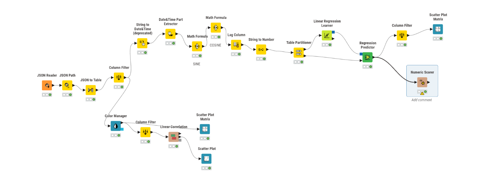

# Localized Climate AI Baseline: Linear Regression Benchmark Model

An engineering and classical statistical baseline designed to establish a performance benchmark for localized temperature forecasting in Spain's Mediterranean coast. This repository contains the data engineering pipelines, feature selection frameworks, and initial linear evaluation models used to benchmark subsequent deep learning (LSTM) architectures.

## 📊 Baseline Pipeline Architecture

*Visual layout of the initial data ingestion, feature mapping, and Ordinary Least Squares (OLS) Linear Regression node execution inside KNIME.*

## 🛠️ Project Mechanics & Baseline Strategy

* **API Orchestration & Ingestion:** Built custom command-line and Postman/Newman hooks to cleanly extract and parse 30 years of daily historical climate records (10,950 total JSON data files) from regional meteorological endpoints.
* **Deterministic Feature Alignment:** Handled initial missing values via automated linear interpolation and engineered a matrix of foundational climate attributes—including raw atmospheric pressure shifts, wind vector distributions, and solar exposure metrics.
* **Establishing the Benchmark:** Deployed a classical Ordinary Least Squares (OLS) Linear Regression algorithm to isolate linear correlations. This model deliberately establishes the baseline error rate, revealing the exact limits of non-sequential modeling when confronting highly dynamic, non-linear weather patterns.

## 📈 Initial Performance Metrics
* **Model Baseline Performance ($R^2$):** 0.582
* **Mean Absolute Error (MAE):** 2.84°C
* *Note: This baseline model serves as the computational benchmark for the advanced, non-linear Keras Stacked LSTM project located in my primary repository.*

## 📂 Repository Layout
* `/workflow`: Executable `.knwf` file containing the baseline regression nodes and data partition filters.
* `/daily_weather_files.zip`: Raw data files for upload to KNIME to perform the workflow.

